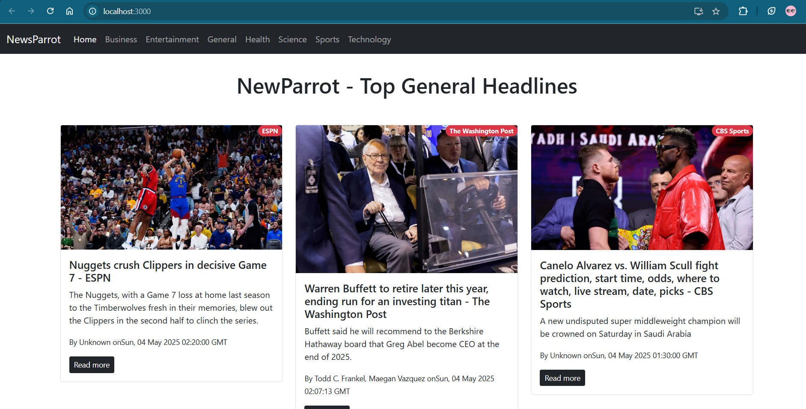

# 📰 NewsParrot

**NewsParrot** is a sleek and modern React-based web application that fetches and displays the latest news headlines from various categories and sources. It provides users with a fast and responsive interface to stay updated with current events.

---

## 🚀 Features

- 🗞️ Real-time news updates  
- 🔎 Category-based filtering (e.g., Technology, Sports, Health, Entertainment)  
- 🌐 Responsive and mobile-friendly design   
- 📚 Powered by [NewsAPI](https://newsapi.org/) or any custom news API  
- ⚛️ Built with React and functional components  

---

## 📷 Screenshot



---

## 🛠️ Tech Stack

- **Frontend**: React.js, React Router  
- **Styling**: CSS Modules / Bootstrap  
- **API**: [NewsAPI](https://newsapi.org/) or another public news API  

---

## 📦 Installation

```bash
git clone https://github.com/yourusername/NewsParrot-Headlines.git
npm install
npm start
🔧 Environment Variables
Create a .env file in the root directory and add your API key:

REACT_APP_NEWS_API_KEY=your_news_api_key
🧭 Folder Structure

newsapp/
├── public/
├── src/
│   ├── components/
│   ├── pages/
│   ├── App.js
│   ├── index.js
│   └── ...
├── .env
└── package.json
